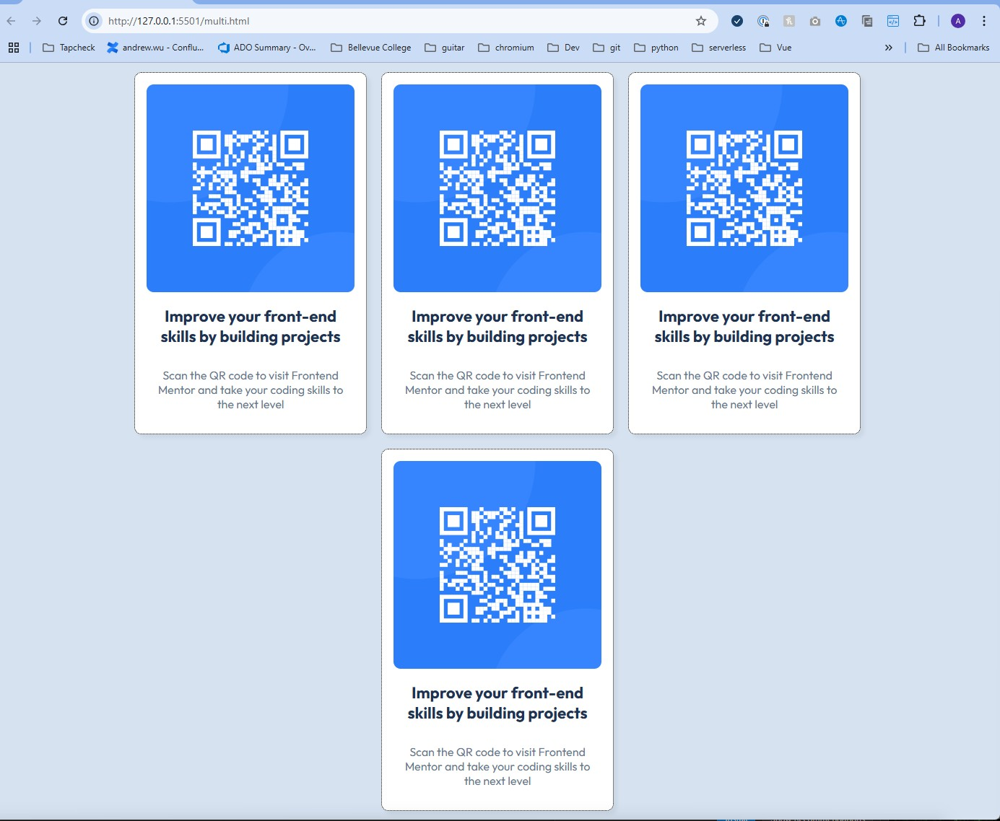
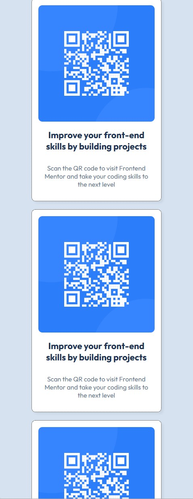
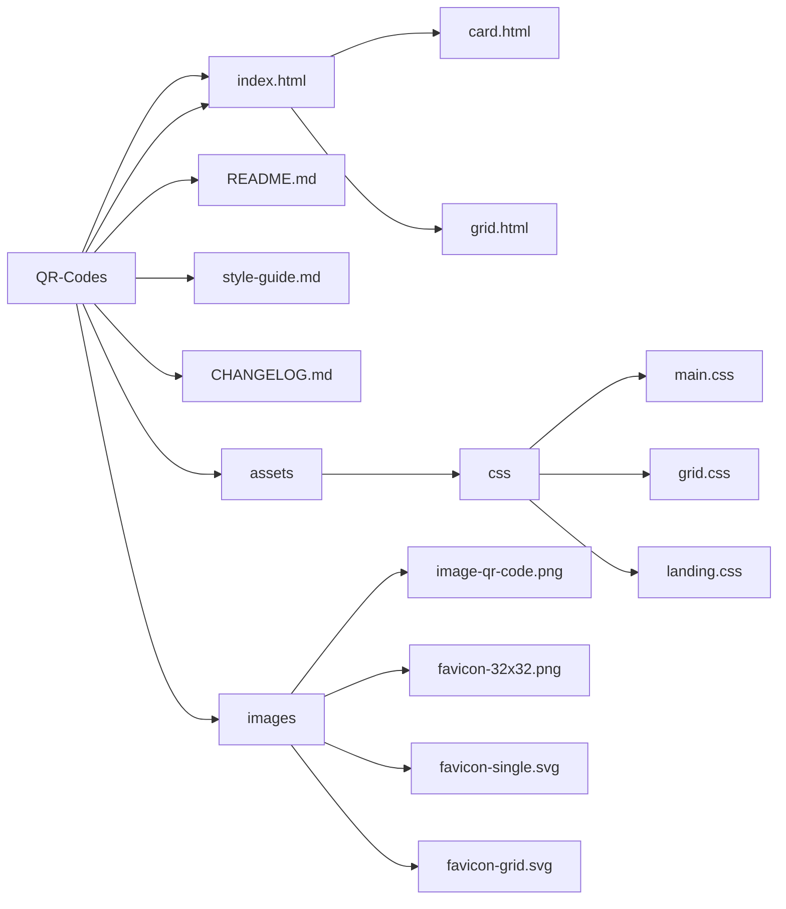
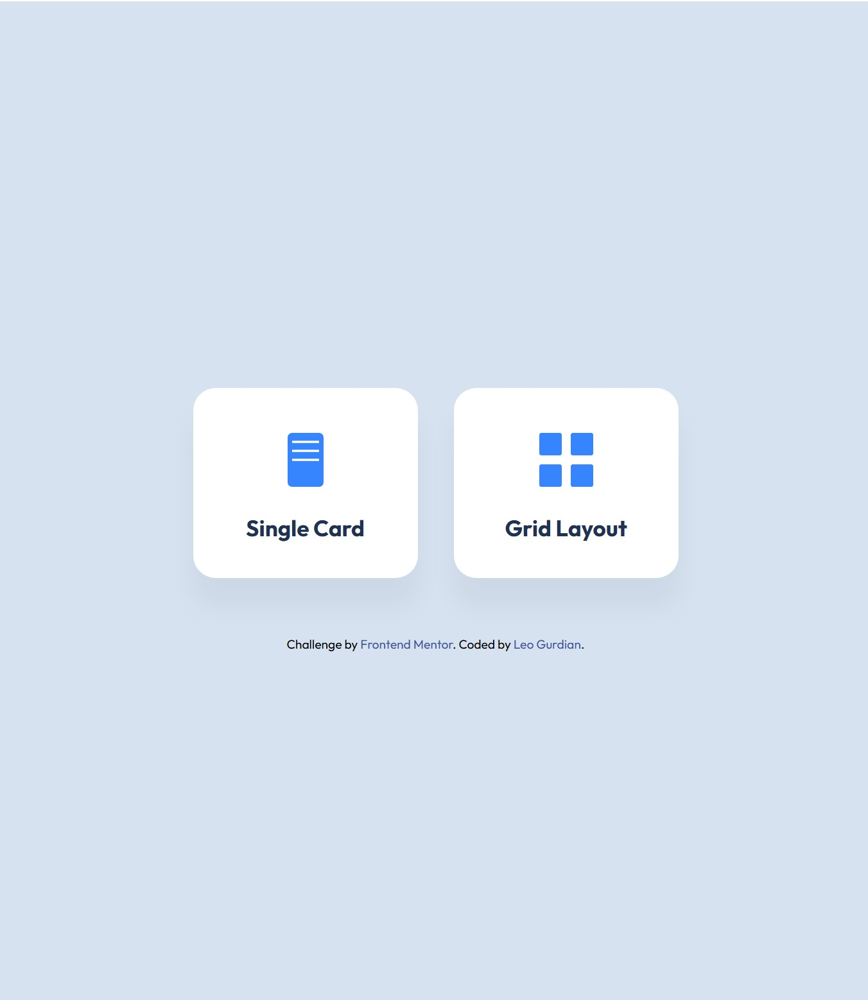

## Welcome! 👋

This project is a solution to the QR code component challenge on Frontend Mentor, extended with a custom landing page and a grid layout demonstration.

### Project Overview

**Functionality**

The website serves as a showcase for a QR code card component. It features a central **Landing Page** that directs users to two distinct implementations:

*   **Single Card View**: A standalone page displaying the component in isolation, centered on the screen.

*   **Grid Layout View**: A page displaying multiple instances of the component arranged in a responsive grid structure.

Both views include a navigation button to easily return to the Home screen.

**Behavior**
*   **Responsive**: The layout adapts seamlessly to different screen sizes. The grid view specifically shifts from a multi-column layout to a single column on devices with widths smaller than 1000px.

*   **Interactive**: Elements are engaging with cards and smooth navigation buttons that lift the elements and deepen their shadows, providing responsie feedback.

**Look-and-Feel**
A clean, modern aesthetic with the "Outfit" typeface and a soothing color palette of Slate Blue  and White .

The interface relies on card-based UI patterns with soft rounded corners and gentle drop shadows, creating a polished and professional appearance.

See the [Style Guide](style-guide.md) for detailed design specifications.
 

**Technologies:**

HTML, CSS, and [Mermaid.js](https://www.mermaid.ai) for diagramming.

## The challenge

The Frontend Mentor challenge is to build a QR code component and get it looking as close to the pictures of the following designs: 

### Challenge 1: Single QR Code

<figure>
     <alt="QR Code Desktop design image.">
 
<Figure-caption>Figure 1. Desktop QR Code design</figure-caption>
</figure>

<figure>
     <alt="QR Code Mobile design. image.">
 
<Figure-caption>Figure 2. Mobile QR Code design.</figure-caption>
</figure>
 

### Challenge 2: Multiple QR Codes

<figure>
     <alt="QR Code Desktop design image.">
 
<Figure-caption>Figure 1. Desktop QR Code design</figure-caption>
</figure>

<figure>
     <alt="QR Code Mobile design. image.">
 
<Figure-caption>Figure 2. Mobile QR Code design.</figure-caption>
</figure>
 

## Website Structure

All the **required assets** are in the `/assets` and `/images` folder. (Images are optimized.)

Use best judgment for displaying JPG files. e.g. `font-size`, `padding` and `margin`. 

The `style-guide.md` contains the color palette and fonts specifications.

## Website

* [GitHub repo](https://LeoLinkDev.Github.io/)

